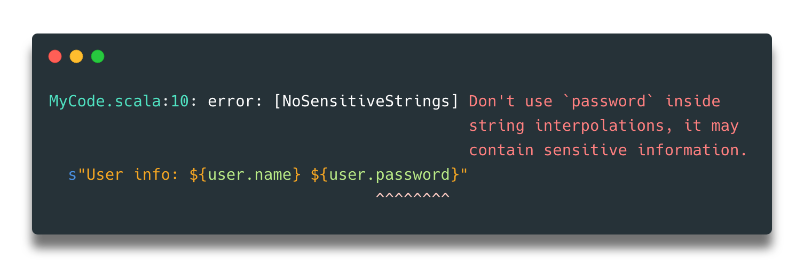

# Scalafix rule for avoiding sensitive interpolations

This rule reports errors when a "sensitive" type is used inside a string interpolation.



## Installation

```sbt
scalafixDependencies += "com.alejandrohdezma" %% "sensitive-strings" % "0.3.1"
```

## Configuration

By default, this rule does not disable any particular type. Add them to `symbols` configuration.

```hocon
NoSensitiveStrings.symbols = []
NoSensitiveStrings.regex = []
```

### Examples

```hocon
NoSensitiveStrings.symbols = [
  com.alejandrohdezma.domain.Password,
  com.alejandrohdezma.domain.UserContext,
  com.alejandrohdezma.domain.UserAccount
]
NoSensitiveStrings.regex = [
  "com\\.alejandrohdezma\\.domain\\..*"
]
```

#### Regex

As you can see in the previous example, you can also match against a list of regex using the `regex` configuration and providing a list of patterns.
